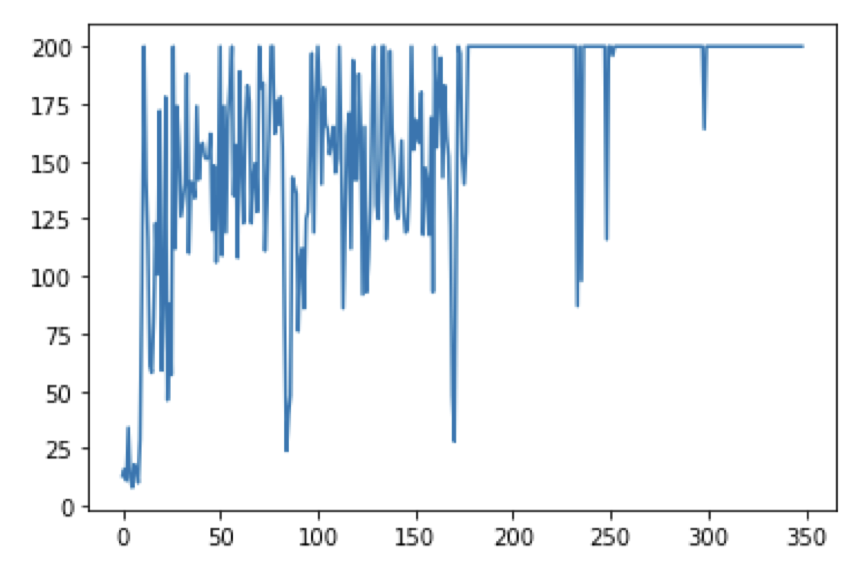
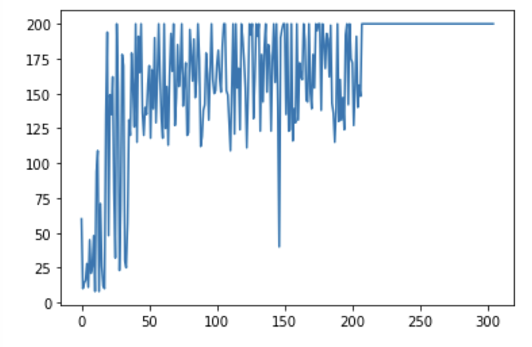
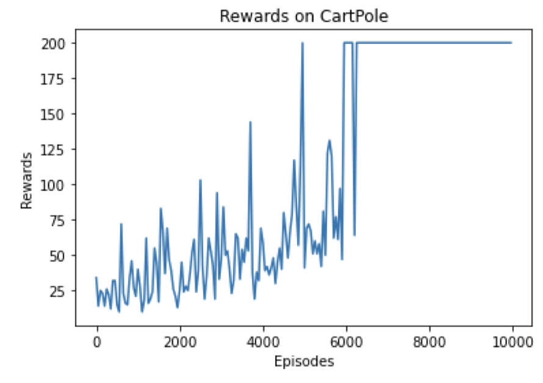
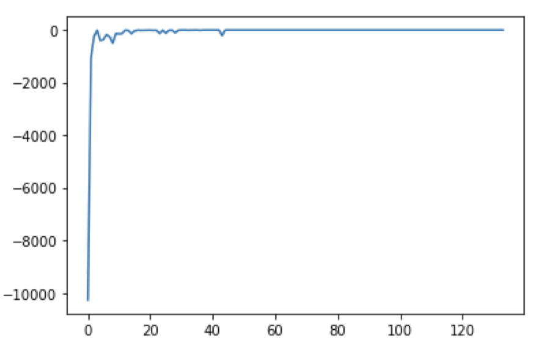
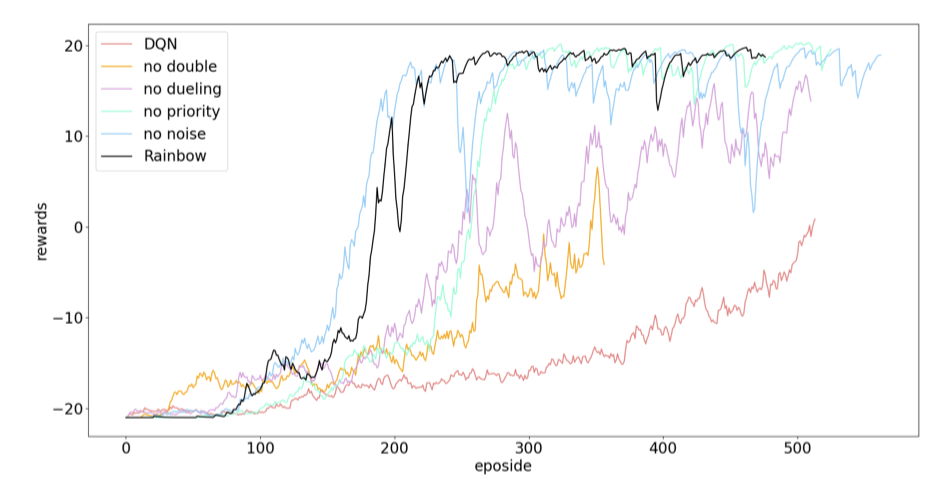

# Reinforcement_Learning_BIT
Project for Reinforcement Learning class (BIT北理工，强化学习)

#### 文件夹结构

```commandline
├──work1(第一次实验：gym的CartPole&Cliffwalking)
│   ├── CartPole-v0.ipynb(based on Q-Learning/SARSA)
│   ├── CartPole_DQN.ipynb(based on DQN)
│   ├── Cliffwalking-v0.ipynb(based on Q-Learning/SARSA/expected SARSA)
├──work2(第一次实验：rainbow)
│   ├── 实验报告.pdf
│   ├── rainbow
│   │   ├── common（具体各层的细节）
│   │   ├── Agent.py
│   │   ├── Network.py（网络结构）
│   │   ├── train_ll.py（训练文件）
│   ├── Ablation
│   │   ├── no_ddqn
│   │   ├── no_duelingdqn
│   │   ├── no_noise
│   │   ├── no_per
│   ├── 其他网络模型
│   │   ├── atari_dqn
│   │   ├── atari_ddqn
│   │   ├── atari_distributed
│   │   ├── atari_duelingdqn
│   │   ├── atari_noisy
│   │   ├── atari_prioritized
```

#### 结果展示

##### work1：使用Q-learning方法玩gym小游戏

以下横坐标为epoch数，纵坐标为reward

- CartPole-v0



<center>SARSA训练过程</center>



<center>Q-Learning训练过程</center>



<center>DQN训练过程</center>

- Cliffwalking-v0



<center>训练过程</center>

##### work2：复现Rainbow文章中的实验<sup><a href="https://arxiv.org/abs/1312.5602">1</a></sup>


<center>7种强化学习网络模型试验结果</center>



<center>Rainbow消融实验结果</center>
